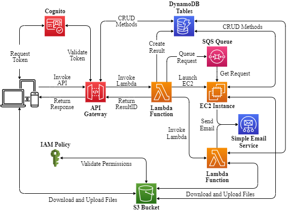

# MAESTRO in the cloud
This repo contains the functions used in the cloud implementation of [MAESTRO](https://vascocandeias.github.io/maestro), a website for multivariate time series analysis using dynamic Bayesian networks which can be [deployed on-premises](#getting-started). The cloud architecture is depicted bellow and was deployed in AWS.

  

You can also find the front-end code [here](https://github.com/vascocandeias/maestro) and an on-premises version of the back-end, for local deployment, [here](https://github.com/vascocandeias/maestro-backend). 
