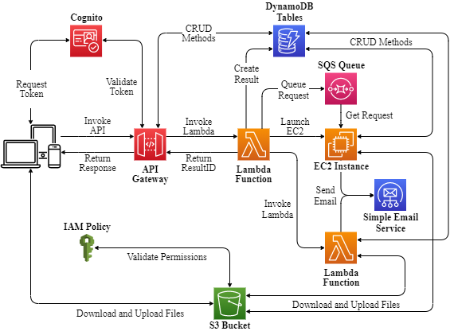

# MAESTRO in the cloud
This repo contains the functions used in the cloud implementation of [MAESTRO](https://vascocandeias.github.io/maestro), a website for multivariate time series analysis using dynamic Bayesian networks which can be [deployed on-premises](#getting-started). The cloud architecture is depicted bellow and was deployed in AWS.

  

This scalable architecture ensures that demanding data analysis software can be efficiently executed in the cloud without concurrent requests influencing eachother. Even though this implementation uses packages based in dynamic Bayesian network, it may also be used to deploy any other data analysis tool, despite the language used for its development.

For a more detailed explanation of this architecture, you may read the resulting [article (available soon)] or underlying [thesis (available soon)].

You can also find the front-end code [here](https://github.com/vascocandeias/maestro) and an on-premises version of the back-end, for local deployment, [here](https://github.com/vascocandeias/maestro-backend).
